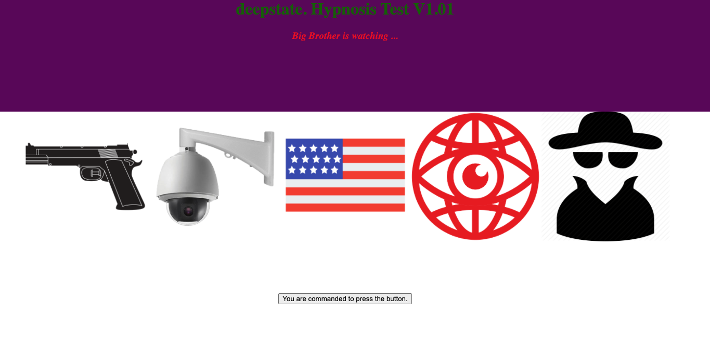
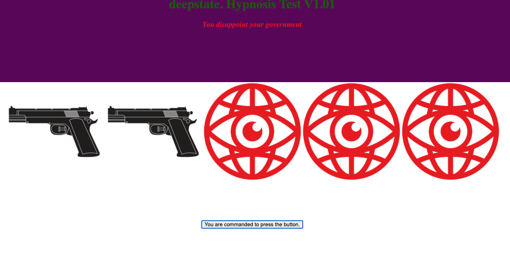

# deepslot.

☐ <deepslot.>: A slot machine game where the house is the winner and the prize is the user. 

Click the level and try your luck. 5 in a row may win you a prize, but at what cost? 

                    Screenshot: Initial Load Screen

                        Screenshot: Failure Screen

                  

☐ Technologies Used: Javascript, HTML, CSS

☐ Getting Started: Run the game by clicking the link here: https://joeyrebbe.github.io/deepslot/

Click the button, see the results. If you get 5 in a row, click the download icon to find out what you've won!

☐ Next Steps: 
            - Add downloadable prizes as audio files, either WAV or MP3.
            - Add and stylize elements to make a more engaging experience.
            - Possibly reduce slot number to give better than 1/3125 odds of winning.

__USER STORY__: As a player, I want to click the button so that I can obtain the secret prize. 
